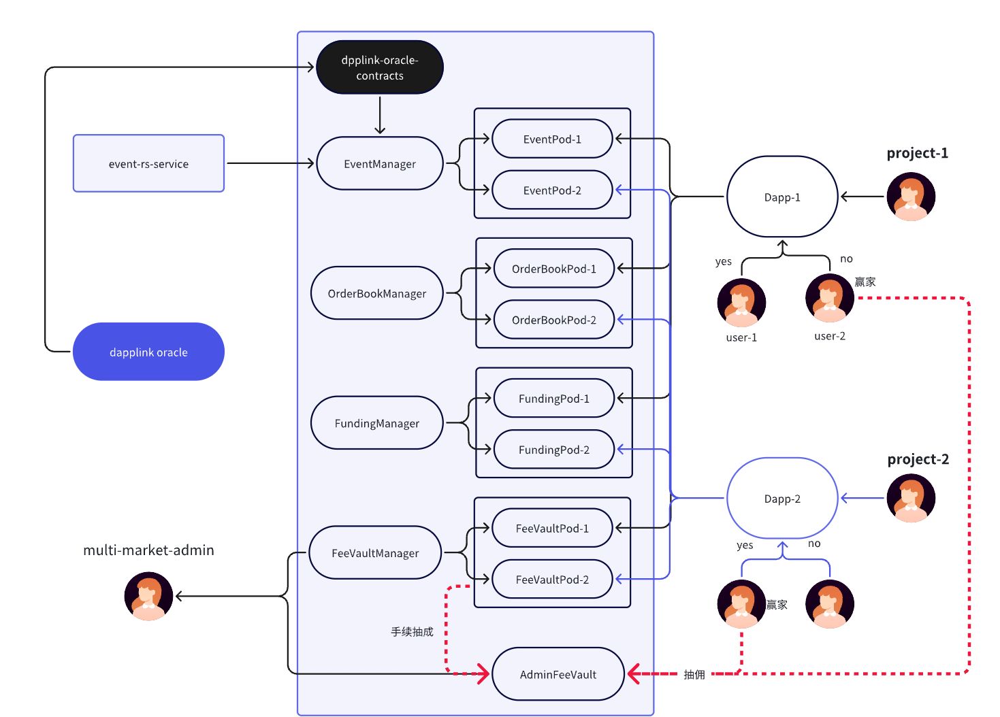

# 去中心化预测市场 BaaS 平台

## 1. 概述

这是一个完全去中心化的事件预测市场区块链即服务 (BaaS) 平台，旨在帮助开发者和项目团队快速构建专属的预测市场。它通过模块化的智能合约架构，实现了事件、资金和平台费用的完全分离。

一句话概括：项目 = 去中心化 + 模块化设计 + 多链支持 + AI 代理驱动的预测市场构建器

主要特点包括：

- 完全基于智能合约构建
- 透明的事件、资金和规则
- 具有可验证的无需信任性的自动结算
- 用户参与门槛低

## 2.平台简介

该平台提供完整且可用于生产环境的技术框架。开发者可以在几秒钟内部署功能齐全的预测市场去中心化应用（DApp）。

核心能力包括：

- 去中心化资金托管（由智能合约自动管理）
- 独立事件架构（互不影响的独立市场）
- 用于快速创建自定义预测市场的 AI 代理开发工具包
- 支持多链，兼容主流区块链生态系统

## 3.系统架构

[](https://github.com/roothash-pay/event-contracts)

### 3.1.智能合约架构

该平台系统采用完全模块化和基于 Pod 的设计，可实现横向扩展和平台隔离：

#### Event Creation & Management

- EventManager: 管理事件生命周期并分发事件更新。
- EventPod: 专用的事件处理 pod，可独立处理不同的事件组。

#### Funding Management & Settlement

- FundingManager: 管理市场资金池、结算逻辑和奖励分配。
- FundingPod: 用于资金跟踪和自动结算的资金池级合约舱。

#### Fee & Revenue Management

- FeeVaultManager: 管理每个项目或市场的费用累积。
- FeeVaultPod: 用于平台隔离的独立费用池。

#### Decentralized Order Matching

- OrderBookManager:：管理用户持仓和订单状态。
- OrderBookPod: 订单簿 pod 独立运行，以实现可扩展性和隔离性。

#### Admin-Level Fee Custody

- AdminFeeVault: 存储汇总的平台级管理费用，并实现收入分成。

## 4.总结

该平台提供了一个模块化、去中心化且对开发者友好的框架，用于构建可扩展的预测市场。凭借基于智能合约的自动化、多链部署能力和人工智能驱动的生成工具，该平台大幅降低了推出安全、透明且可定制的预测市场应用程序的门槛。

## 5.Usage

### 5.1.Build

```shell
$ forge build
```

### 5.2.Test

```shell
$ forge test
```

### 5.3.Format

```shell
$ forge fmt
```

### 5.4.Gas Snapshots

```shell
$ forge snapshot
```

### 5.5.Deploy

```shell

```
